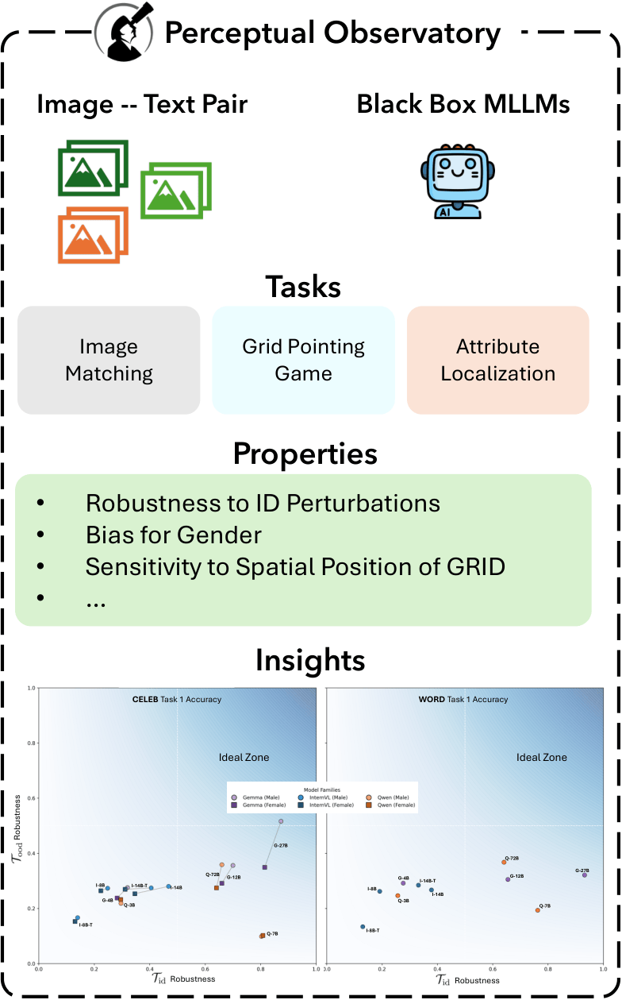

# The Perceptual Observatory: Characterizing Robustness and Grounding in MLLMs

[](https://arxiv.org/abs/2512.15949)
[](https://coral-lab-asu.github.io/PerceptualObservatory/)
[](LICENSE)
[](https://www.python.org/downloads/)

This repository contains code and resources for **The Perceptual Observatory**, a perception-first evaluation framework that characterizes **robustness** and **visual grounding** in multimodal large language models (MLLMs) under controlled perturbations.

---

## Abstract



Modern MLLMs keep improving on end-task benchmarks, but it can be unclear whether gains come from **genuine visual grounding** or from **text-heavy priors / world knowledge**, especially when many model families scale the language component while reusing similar vision encoders.

**The Perceptual Observatory** moves beyond leaderboard accuracy by testing whether models preserve **identity**, **spatial invariance**, and **attribution fidelity** when inputs are systematically perturbed.

The framework evaluates MLLMs across complementary “verticals,” including:

1. **Simple Vision Skills**
   - e.g., **face matching** and **text-in-vision comprehension** to probe basic perceptual capabilities.

2. **Local-to-Global Grounding**
   - e.g., **image matching**, **grid-pointing**, and **attribute localization**, targeting grounded understanding from fine details to global scene structure.

Each vertical is instantiated with **ground-truth datasets** (faces, words) and evaluated under two classes of perturbations:
- **Low-level pixel augmentations** (controlled corruptions / transformations)
- **High-level diffusion-based stylized “illusions”** (style-transfer perturbations)

Together, these tests provide a principled lens into how current (and future) MLLMs maintain perceptual grounding and relational structure under distribution shift.

---


## Overview

PerceptualObservatory supports two stimulus domains:

- **Word** — Text-based concepts (e.g., rendered words with different fonts/cases)
- **Celeb** — Celebrity face images

Tasks include:

1. **Image Matching (IM)** — Select the candidate image that best matches a support image from a set of options
2. **Grid Pointing Game (GPG)** — Localize a target image within a 2×2 grid
3. **Attribution** — Attribute and localize visual features (e.g., augmented vs. illusory)

## Project Structure

```
PerceptualObservatory/
├── prompts/                    # Task prompts for VLMs
│   ├── image-matching-*.txt
│   ├── attribution-*.txt
│   ├── gpg-*.txt
│   └── InternVL-thinking_SYSTEM_PROMPT.txt
├── scripts/
│   ├── extract_embeddings_hf.py    # Extract CLIP embeddings from HuggingFace datasets
│   ├── make_IM_GPC_word.py         # Generate IM/GPC stimuli (word domain)
│   ├── make_IM_GPC_celeb.py        # Generate IM/GPC stimuli (celeb domain)
│   ├── celeb_labels_gender_mapping.py
│   ├── celeb_gender.json
│   ├── image_matching/             # IM analysis & parsing
│   ├── grid_pointing_game/         # GPG analysis & parsing
│   └── attribution/                # Attribution analysis & parsing
└── README.md
```

## Setup

Install dependencies:

```bash
pip install torch transformers datasets pillow numpy tqdm joblib svgwrite cairosvg matplotlib scipy ujson
```

## Usage

### Extract Embeddings

Extract CLIP (or other) embeddings from a HuggingFace dataset:

```bash
python scripts/extract_embeddings_hf.py \
  --hf-dataset /path/to/dataset \
  --output embeddings.jsonl \
  --model openai/clip-vit-base-patch32 \
  --batch-size 32
```

### Generate Stimuli

**Word domain** (requires word dataset, celeb dataset, and word JSON with embeddings):

```bash
python scripts/make_IM_GPC_word.py \
  --word_hf /path/to/word_dataset \
  --celeb_hf /path/to/celeb_dataset \
  --word_json /path/to/word_embeddings.json \
  --out_dir ./output
```

**Celeb domain** (requires celeb dataset, word dataset, gender mapping, and embeddings):

```bash
python scripts/make_IM_GPC_celeb.py \
  --celeb_hf /path/to/celeb_dataset \
  --word_hf /path/to/word_dataset \
  --celeb_gender scripts/celeb_gender.json \
  --embeddings_json /path/to/embeddings.json \
  --out_dir ./output
```

### Analysis

**Image Matching** — Place JSONL results in `./results_im/word/` (or `celeb/`), then run:

```bash
python scripts/image_matching/parse_im_word.py   # outputs to ./results/all_parsed_word_im.json
python scripts/image_matching/analysis_word_im.py
```

**Grid Pointing Game** — Parse JSONL files from a folder and analyze:

```bash
python scripts/grid_pointing_game/parse_gpg_word.py --folder ./results_gpc/word/ --out-json ./results/all_parsed_word_gpc.json
python scripts/grid_pointing_game/analysis_word_gpg.py --parsed_json ./results/gpg/word/all_parsed_word_gpc.json --out ./results/gpg/word/avg_performance_word_gpc.json
```

**Attribution** — Attribution parsers expect results in specific folder structures; run from the `scripts/attribution/` directory. Analysis scripts (e.g. `analysis_word_attribution.py`, `analysis_celeb_attribution.py`) load parsed JSON from `./results/attribution-*/`.

Replace `word` with `celeb` for the celebrity domain. GPG celeb parsing also accepts `--celeb-cache` for celebrity metadata.

## Data Format

Stimuli are stored as JSON records with base64-encoded images. Each record typically includes:

- `task_id` — Unique identifier
- `support` — Support image and metadata
- `options` / `grid_b64` — Candidate images or 2×2 grid
- `answer_idx` — Ground-truth answer index or cell position

## Citation

If you use PerceptualObservatory in your research, please cite:

```bibtex
@misc{anvekar2025perceptualobservatorycharacterizingrobustness,
      title={The Perceptual Observatory Characterizing Robustness and Grounding in MLLMs}, 
      author={Tejas Anvekar and Fenil Bardoliya and Pavan K. Turaga and Chitta Baral and Vivek Gupta},
      year={2025},
      eprint={2512.15949},
      archivePrefix={arXiv},
      primaryClass={cs.CV},
      url={https://arxiv.org/abs/2512.15949}, 
}
```


## License

See repository for [LICENSE](LICENSE) information.
